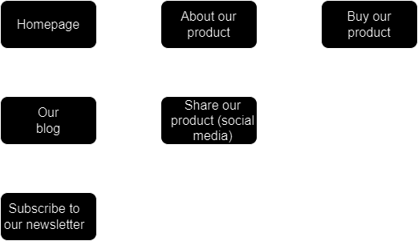
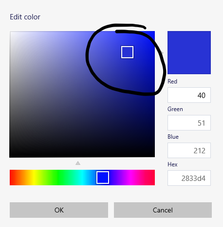

 

  

---

Workflows/best practices for coding. I should be updating this a lot, so said workflows should be pretty well thought out!

I am <b><i>very</b></i> open to contributions, feedback, or any other form of help/communication! One person writing this may, and likely will, create a very opinonated environment.
Also, please keep in mind that this is not meant to be some rigid guideline that everyone follows. Take everything with a grain of salt.

All of this is a major learning experience for me, and I'll continuously refine the workflows, notes, and ideas in this file!

 

# Best methods of practice for X + Outlining and workflows:

Workflows for certain problems, where X is a problem, bug, question, ect. As previously mentioned, nothing here is intended to be a rigid solution to every problem. Similar to design patterns, these workflows are meant to be `guidelines on how to tackle certain problems`, which yes, is a direct quote from [design-patterns-for-humans](https://github.com/kamranahmedse/design-patterns-for-humans#introduction).

 

## The Big 2 🥈

The 2 **_REALLY_** important things to do every time you encounter a bug:

**1. Check the syntax**

> This is a crucial part of almost every single one of my workflows, and you'll see it mentioned again and again. Even if you're working in an editor with linting/syntax highlighting, still check it. I've struggled on a lot of very simple errors because I thought that my editor would catch it.

**2. Walk through your logic with whiteboarding/pseudocode**

> Whiteboarding is a generally good habit to be in. Make sure to leave plenty of spaces between your "lines of code" so you can come back and change things later!

Also, be prepared to whiteboard a little bit differently for every problem. One problem might require a flow chart of sorts, and another might require a diagram. Adaptability is important.

  

# Mini Workflows

## Learning DSA/working through Leetcode problems 👨‍💻

When you're learning, keep in mind that:

> Data structures aren't just about organizing data, it's also about the operations that we use on those data structures.

> Try to gain a deeper understanding of DSA (Data Structures and Algorithms), and avoid memorizing the answers.

> Don't waste your time on Leetcode. Spend a maximum of 60 minutes working on a problem, and if you can't figure it out, look at the solution. Just make sure you understand _why_ the solution works

### Understanding Leetcode problems 📖

**_Use REACTO:_**

1. Repeat: make sure you do understand the problem.
2. Example: get insights by doing examples
3. Approach: come up with your approach(es) to the problem (brute force first)
4. Code: write the code for your chosen approach
5. Testing: pass the testcases
6. Optimize: optimize the complexities (time and space) of your algorithm

_The above was written by by [this Youtube account](https://www.youtube.com/channel/UC9s8Wy4D_4dsFjwiufqNAng)_

Practice is the most important thing here. Other than that, make sure you actually solve the problem each time. Here's my little guide(that I try to constantly update and change) to successfully do Leetcode problems. Additionally, this workflow should help you actually absorb the information and understand the concept:

Before I knew about REACTO, I made up my own method of solving these problems:

**1. Write the problem out**

> - Identify what you need to find to solve the problem
> - Ideally do this on a whiteboard (leaving plenty of space), but if you can't, do it in the comments.
> - Make sure your comments are friendly to **_you_**

**2. Review your written problem a few times**

> - Go back over it a few times, check for "plot holes"
> - Is there anything that differs from the original prompt?
> - Is there anything that you could do to make this better?

**3. Start coding**

> - Explain the problem to yourself (and someone else, if someone else is present) as you code
> - Write it out. No matter what, walk yourself through a testcase on a whiteboard or something in similar fashion.
> - Practice backtracking through your code; you'll often find yourself doing this when you realize that something needs to be changed

**4. Revising your algorithm**

> - Optimize the overall running time first, then optimize constants. Consider what other data structures you could be using, and talk through the tradeoffs of each.
> - It's ok to completely redo something! Just make sure you save your working answer
> - If you can't find anything to completely redo, look at how you can optimize your current algorithm

**5. When you finish**

> - Reflect on negative tendencies, on any subproblems that you're not doing so well on. Make sure to go back and practice/review anything that you had trouble with
> - Write it out again, if there was a mistake, and if there wasn't
> - Why did I come up with this solution?
> - Do you need all of this code that you wrote, or is there a lot of boilerplate (this step is mainly for constants)?
> - Is there something you could do differently? How can you make sure you do that next time?

Credit to _haekuh#0254_ for this part ^^

**6. The "Post Problem"**

> - Once you're finished with the problem, write your solution down somewhere. Consider why this solution works. What elements of the algorithm allow it to execute correctly?
> - You can't write or memorize the entire problem, so try and stick to a few sentences, one paragraph at most.
> - Google docs/sheets or any similar program works well for this

 

# UI/UX/General website design ✍

Before you start reading, remember that:

> All of this is a major learning experience for me, and I'll continuously refine the workflows, notes, and ideas in this file!

Just keep that in mind, and if there's anything you disagree with, feel free make a pull request!

## Resources 📚

A collection of resources that you might want to consider when desigining a UI or optimizing UX:

#### Tools

- [Figma](https://www.figma.com) - Good for designing, wireframing, and all sorts of things
- [PaletteGenerator](https://realtimecolors.com/palettes/?colors=e9e4f6-05020b-5E40BA-17102e-7756d8#generator) - Color palette generator
- [ColorSpace](https://mycolor.space/?hex=%2300766B&sub=1) - Another color palette generator
- [Adobe Color Wheel](https://color.adobe.com/create/color-wheel) - A very in-depth/technical color wheel for creating color harmonies

#### Videos

- [How to pick the right colors for your website or app](https://www.youtube.com/watch?v=ewRYw4pnKQU)
- [How to make UI color palettes](https://www.youtube.com/watch?v=yYwEnLYT55c)

## User flows 🌊

Before you even start desigining your website, you should map out where you want the user to go, from start to finish. It might look something like this:

 

  

 

While this is a very basic rendition of a user flow, it does give you a good idea of what one might look like. In my opinion, you shouldn't stress over it too much, just make sure it looks generally nice (and complete!).

## Wireframing 🔌

Now that you have an idea of where you want the pages to go, it's time to start desigining the page! The process will be similar to creating your userflow, except a little bit more in depth.

When you design your wireframe, focus on creating connected pages, layouts in said pages, and anything else like that! In case you're confused, here's a very simple example:

 

  

 

As you can see, this provides us with a nice little outline from which we can build off of! For example, maybe we know that we want a title card on the front page. Our leftmost design (see above) has a nice place for that, but it also wouldn't be very hard to move that title card around a little bit.

Additionally, if you want to see how this looks in a real world example, check out the [Figma](https://www.figma.com/file/Ch27DuyaY8za2Y3TAQr7Ls/MiniWorkflowsExamples?type=design&node-id=0-1&mode=design&t=DmqHs5sV2cwZ3ho0-0) that I designed this on!

Finally, Keep It Super Simple (KISS). No one likes a web page with 13 different buttons. I would personally advise you to design your wireframe very minimalistically, as to avoid confusion in the future.

## Design System 🔨

An important part of design systems are reusable components (yes, like React!). They can be very intricate and extensive, but in general, they're just something along the lines of:

- [Color palette](#color-palettesand-how-to-choose-one)
- Styling for certain buttons
- Main font(s)
- ...

And the list goes on! Just remember that this is a very simple example, and it might get a bit more fancy in the real world.

### Color palettes,and how to choose one

I don't know about you, but I've _always_ struggled with choosing a nice color palette. Any time I find or create one, there's either one color that I don't like, or I just can't figure out how to properly utilize the palette on a real website. This section should _hopefully_ help you figure that out!

#### "Sorting" your colors

It can be a bit tricky to choose a color palette without figuring out how to "sort" your colors. Here's how I like to do it:

- Background
- Text
- Primary
- Secondary
- Accent
- 2 Semantic colors (eg. an error and a success color)

You might hear some people say that you should have exactly 9 shades of each of your colors, and while they aren't wrong, I find that a bit excessive for most projects. If I need a lighter or darker shade, I just create that shade when I need to.

#### The 60-30-10 rule

You'll almost definitley see this term at somepoint, and all it's saying is that 60% of your designs color should be your primary, 30% should be your secondary, and 10% should be your accent. Of course, it's not a hard and fast rule, but more of a general guideline.

#### Picking a primary color

First off, find a basic color that you like. Ideally, this color (or something similar to it) will be your primary color. If you're working off of a preexisting brand, then your primary color might just be your brand color. Whatever it is, just make sure it's not too glaring! Neon green might be a little bit tricky to design a UI around.

Here's a good rule of thumb; your primary color will normally be in the upper right section of the color picker. For example:

 

  

 

This will normally result in a color that is bright enough to draw attention, but not bright enough to be annoying. _P.S: Credit to [UX Tool's](https://www.youtube.com/watch?v=yYwEnLYT55c) video for this idea!_

Also, if you're having trouble coming up with primary color ideas, you can use tools like [ColorSpace](https://mycolor.space/?hex=%2300766B&sub=1) or [PaletteGenerator](https://realtimecolors.com/palettes/?colors=e9e4f6-05020b-5E40BA-17102e-7756d8#generator) to generate palettes, which you can pick different colors off of. However, I don't personally recommend using these tools to create your _entire_ palette.

#### Picking a secondary color

Your secondary color should stand out (but not in an obnoxious way), and it should compliment your primary color. When choosing a secondary color, I like to use the [Adobe Color Wheel](https://color.adobe.com/create/color-wheel). You can input a primary color, and then apply different color harmonies to see which one looks best!

#### Picking an accent color

In my experience, this is either the easiest part or the hardest part. Your accent color should accent your primary, secondary, and any other colors/shades that you might have.

A good example is the blue on Facebook. Most of Facebook is gray/white, but the portions of it that aren't have blue highlights, so it makes the overall design feel blue, but not in an overbearing or negative way!

When you get around to picking your accent color, yet again, I like to use the [Adobe Color Wheel](https://color.adobe.com/create/color-wheel), and optimally, find something that accents my primary color.

### Utlizing your color palette

Now that you have your color palette, what the heck should you do with it?

If you haven't created your wireframe yet, go ahead and do that. In my opinion, the best thing to do is to fill your wireframe in with your color palette, instead of coloring your wireframe as you create it. I.e, go ahead and design everything on grayscale, and once you're happy with how it looks, use your color palette to color it in!

We're doing this because in my (rather short) experience, it's very challenging to create a new object _and_ color it in at the same time. But hey, if that works for you, go for it!

And again, if you haven't considered it already, consider using the 60/30/10 rule. It's incredibly helpful when it comes to desigining a UI.

## Designing your UI (finally!) 👷‍♂️

That was a long section, wasn't it! Now that you have everything in your design system ready to go, it's time to start designing. Here's some things that I like to keep in mind while I'm designing:

- Creativity may play a major role, but a lot of UI design is, in my opinion, following some general rules and guidelines
- Visual hierarchy helps show the importance of items
- Contrast helps distinguish elements
- Balance helps moderate the spacing of elements
- Consistency helps keep elements harmonical and avoids confusion
- Simplicity (remember KISS?) helps keep things straightforward
- Feedback keeps users engaged

## Finishing up 🏁

Are we finally done? Well, you probably aren't. It takes a lot of practice to get good at something, and you probably won't be able to design a nice looking UI in a day, probably not even a week.

Just remember that designing is a lot of trial and error. You might initially love something, but find that it completely clashes with another element of your design, or that you just don't like it later on. Always feel free to make big changes, or if you want to go the nuclear route, start over!

 

## Encountering an incorrect function return 🤖

**1. [The Big 2](#the-big-2)**

**2. Walk through the function**

> - Go past the function you're working in
> - Go through every function that is called/used in said function
> - Go into documentation if the function is built in
> - Figure out what it should be returning, and why it should be returning that value

**3. Minimize**

> - Take away as many functions as possible, and try and isolate the problem function

**4. Find context**

> - Look at some other code that involves this function. What does it do differently/the same?
> - If it's your own function, attempt to isolate the sub-function (if you will), and do the same for that function

 

## Encountering a bug 🐛

**1. [The Big 2](#the-big-2)**

**1.5. If it's an algorithm**

> - Are you considering all possible data structures?
> - Are you running into an edge case?
> - Did you whiteboard it, and truly think through it?

**2. Reference other code of yours**

**2.5. Before you google it**

> - Should I know this code?
> - Should I be able to do this?
> - Did I thoroughly complete steps 1-3?

**3. Google it**

**3.5. Before you use AI/ask a human**

> - Have you done everything else you could?
> - Are there any other methods that I could use?
> - Would a person be better suited to this question?

**4A. Ask a human being**

> - There are plenty of amazing online communities that are here to help!
> - Places like [TPH (The Programmers Hangout)](https://discord.gg/programming) and language specific communities are frequently found on places like Discord and Reddit. Ask good questions, and always be nice!
> - GPT tends to be better for technicals/minor errors, but past that, humans will always excel in the artistic design of code

**4B. Ask GPT (Or a similar tool)**

> - Make sure you _completely_ understand why you couldn't solve the problem
> - Practing similar problems isn't a horrible idea, althought it may be incredibly time consuming.

 

## How to google it (properly!) 🔍

A lot of information is likely taken from [this video](https://www.youtube.com/watch?v=cEBkvm0-rg0). Some of my own thoughts, experiences, and opinions will be mixed in there as well.

"Googling it" is a really important skill to have, because who doesn't just copy and paste their error into google? Here's some helpful techniques:

> - Use quotations around your search term to force google to only give you exact matches
> - If you only want results from a certain site, enter the site like so: site:google.com (Only returns results from google.com)
> - If you don't want to find a certain result, use the "-" symbol like so: "good python frameworks -django"
> - Filter old, new, and _any range of_ content out with the after:, before:, and DATE..DATE operators like so: how to program in C++ after:2017
> - Use the wildcard operator (" \* ") to find subdomains and come up with new ideas!
> - Search for certain file types with the filetype: operator like so: cute cats filetype:png
> - Look at some related sites with the related: operator like so: related:angular.io
> - Find the latest cached version of your website with the cached: operator like so: cached:yourwebsite

 

# Thoughts, opinions, and ideas:

This is just a collection of me rambling about random things I'm thinking about (computer/workflow related, of course)

## Introduction 📝

_I'm 16, I'm not a psychologist_

All of these workflows are really intended for **_education_**, not just for you to code as quickly as possible. That's the secondary goal of course, but if that was truly the primary goal, there would be one section telling you to go straight to ChatGPT.

## Planning 👷‍♂️

Planning is so incredibly important. The only time I don't completely plan my software out is when it's one file, and **_I know_** that it's going to be shorter than 80 some lines.

If you don't plan your work out, it becomes so much more tiring to keep track of your goals, and your current place in those goals. This kinda flows into the next section, Breaks.

## Breaks 💤

Breaks are also **_very_** important! Whether you want to be as refined as the Pomodoro technique, or you just take breaks sporadically, like me, breaks are incredibly imporant.

I also feel like your mind works a lot better in the background (i.e., the subconscious), than it does in your “conscious” state. What I’m getting at is, if you’re stuck on something, go stare at something and think about something else. Professional chess players do it, so it must work, right?

## Learn by doing, not by looking 👩‍🏭

I'm a firm believer in this concept, and if you're reading this, it's likely that you are too. You can read documentation all you want, grind out W3 Schools tutorials, but until you sit down and push yourself through something that you didn't do yesterday, you're not really "learning". Even if you're taking notes, or copying the tutorial down into your own editor, I still don't think it equates to actually doing something. Learning is hard, and while repetition can help, actually challenging yourself will really do the trick.

However, a major problem comes with said concept. That problem being projects; i.e. what projects to do, when, and where. In my opinion (_please remember that I'm 16_), beginners struggle with this the most, because there's no prior experience to help guide you into a new language or framework. However when you take someone who already knows concepts and 1 or 2 languages, the entire dynamic of the whole process changes. You already have a foothold to step on, and leap into that. I think this flows somewhat nicely into the next topic, Tutorial Hell.

## Tutorial Hell 👨‍🏫

I think tutorials are both a blessing and a curse. On one hand, it can be quite a pain to struggle through the basics of a language without some guiding you, but on the other hand, you could _(and probably will!)_ become very dependent on them. I feel like it's very easy for you to get sucked into an "easy" way of doing things, and not taking the time to struggle through projects/bugs on your own.

Once in, Tutorial Hell is a hard thing to get out of. As I partially mentioned, it feels a lot better to understand a topic immediately, rather than really putting in the effort to have a deeper and more permanent understanding of it. As I've previously mentioned, I think that it's a lot better to sit down and struggle through a problem first, rather than simply looking at the answer.

## Closing thoughts 💭

Take everything I and others say with a grain of salt. Figure out what works for you. Ideas like this shouldn't be encompassing, but just an idea, in a sea of other ideas.

Finally, not to be the shameless plug, but I do write about similar topics on my [blog.](https://dev.to/kurealnum)
