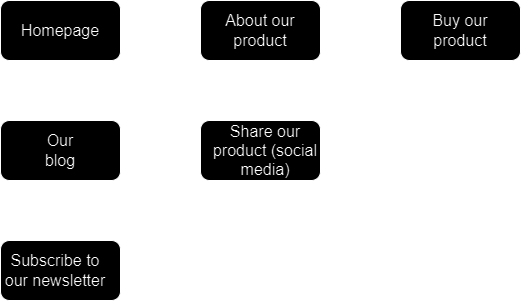
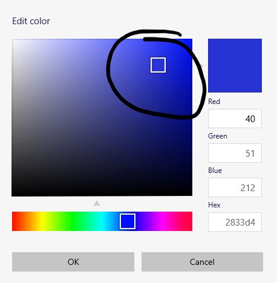

# TODO

- Website design workflow?
- Find and contribute more topics!
- Add/update resources for certain topics
- Move some notes from [my notes](https://drive.google.com/drive/folders/1dsKtlQvBVS0YjssJrlLmZ9SU0yh8zz9m) as workflows/ideas

## Website design workflow ideas

Just a general outline!

1. User Flows
2. Wireframing
3. Design system
4. Designing
5. Critiquing
6. Testing

Opinions?

I'm working on this in the TODO file because I don't know exactly where I want to put it right now, but I will find a place for it!

  
  
  

# UI/UX/General website design

Before you start reading, remember that:

> All of this is a major learning experience for me, and I'll continuously refine the workflows, notes, and ideas in this file!

Just keep that in mind, and if there's anything you disagree with, feel free make a pull request!

## Technologies

Here are some technologies you might want to consider when desigining a UI or optimizing UX!

- [Figma](https://www.figma.com) - Good for designing, wireframing, and all sorts of things
- [PaletteGenerator](https://realtimecolors.com/palettes/?colors=e9e4f6-05020b-5E40BA-17102e-7756d8#generator) - Color palette generator
- [ColorSpace](https://mycolor.space/?hex=%2300766B&sub=1) - Another color palette generator
- [Adobe Color Wheel](https://color.adobe.com/create/color-wheel) - A very in-depth/technical color wheel for creating color harmonies

## User flows

Before you even start desigining your website, you should map out where you want the user to go, from start to finish. It might look something like this:

 

  

 

While this is a very basic rendition of a user flow, it does give you a good idea of what one might look like. In my opinion, you shouldn't stress over it too much, just make sure it looks generally nice (and complete!).

## Wireframing

Now that you have an idea of where you want the pages to go, it's time to start desigining the page! The process will be similar to creating your userflow, except a little bit more in depth.

When you design your wireframe, focus on creating connected pages, layouts in said pages, and anything else like that! In case you're confused, here's a very simple example:

 

  

 

As you can see, this provides us with a nice little outline from which we can build off of! For example, maybe we know that we want a title card on the front page. Our leftmost design (see above) has a nice place for that, but it also wouldn't be very hard to move that title card around a little bit.

Additionally, if you want to see how this looks in a real world example, check out the [Figma](https://www.figma.com/file/Ch27DuyaY8za2Y3TAQr7Ls/MiniWorkflowsExamples?type=design&node-id=0-1&mode=design&t=DmqHs5sV2cwZ3ho0-0) that I designed this on!

## Design System

An important part of design systems are reusable components (yes, like React!). They can be very intricate and extensive, but in general, they're just something along the lines of:

- [Color palette](#color-palettesand-how-to-choose-one)
- Styling for certain buttons
- Main font(s)
- ...

And the list goes on! Just remember that this is a very simple example, and it might get a bit more fancy in the real world.

### Color palettes,and how to choose one

I don't know about you, but I've _always_ struggled with choosing a nice color palette. Any time I find or create one, there's either one color that I don't like, or I just can't figure out how to properly utilize the palette on a real website. This section should (hopefully) help you figure that out!

#### "Sorting" your colors

It can be a bit tricky to choose a color palette without figuring out how to "sort" your colors. Here's how I like to do it:

- Background
- Text
- Primary
- Secondary
- Accent
- 2 Semantic colors (eg. an error and a success color)

You might hear some people say that you should have exactly 9 shades of each of your colors, and while they aren't wrong, I find that a bit excessive for most projects. If I need a lighter or darker shade, I just create that shade when I need to.

#### The 60-30-10 rule

You'll almost definitley see this term at somepoint, and all it's saying is that 60% of your designs color should be your primary, 30% should be your secondary, and 10% should be your accent. Of course, it's not a hard and fast rule, but more ofjust a general guideline.

#### Picking a primary color

First off, find a basic color that you like. Ideally, this color (or something similar to it) will be your primary color. If you're working off of a preexisting brand, then your primary color might just be your brand color. Whatever it is, just make sure it's not too glaring! Neon green might be a little bit tricky (but not impossible!) to design a UI around.

Here's a good rule of thumb; your primary color will normally be in the upper right section of the color picker. For example:

 

  

 

This will normally result in a color that is bright enough to draw attention, but not bright enough to be annoying. _P.S: Credit to [UX Tool's](https://www.youtube.com/watch?v=yYwEnLYT55c) video for this idea_

Also, if you're having trouble coming up with primary color ideas, you can use tools like [ColorSpace](https://mycolor.space/?hex=%2300766B&sub=1) or [PaletteGenerator](https://realtimecolors.com/palettes/?colors=e9e4f6-05020b-5E40BA-17102e-7756d8#generator) to generate palettes, which you can pick different colors off of. However, I don't personally recommend using these tools to create your _entire_ palette.

#### Picking a secondary color

Your secondary color should stand out (but not in an obnoxious way), and it should compliment your primary color. When choosing a secondary color, I like to use the [Adobe Color Wheel](https://color.adobe.com/create/color-wheel). You can input a primary color, and then apply different color harmonies to see which one looks best!

#### Picking an accent color

This is the tricky part, at least for me.
