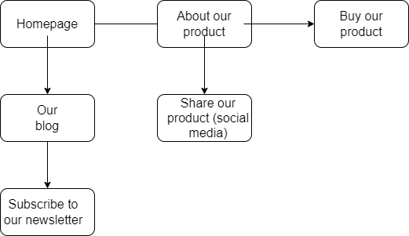

# TODO
- Website design workflow?
- Find and contribute more topics!
- Add/update resources for certain topics
- Move some notes from [my notes](https://drive.google.com/drive/folders/1dsKtlQvBVS0YjssJrlLmZ9SU0yh8zz9m) as workflows/ideas

## Website design workflow ideas
Just a general outline!

1. User Flows
2. Wireframing
3. Design system
4. Designing
5. Critiquing 
6. Testing

Opinions?

# User flows
Before you even start desigining your website, you should map out where you want the user to go, from start to finish. It might look something like this: 
 

  

 

While this is a very basic rendition of a user flow, it does give you a good idea of what one might look like. In my opinion, you shouldn't stress over it too much, just make sure it looks generally nice (and complete!).